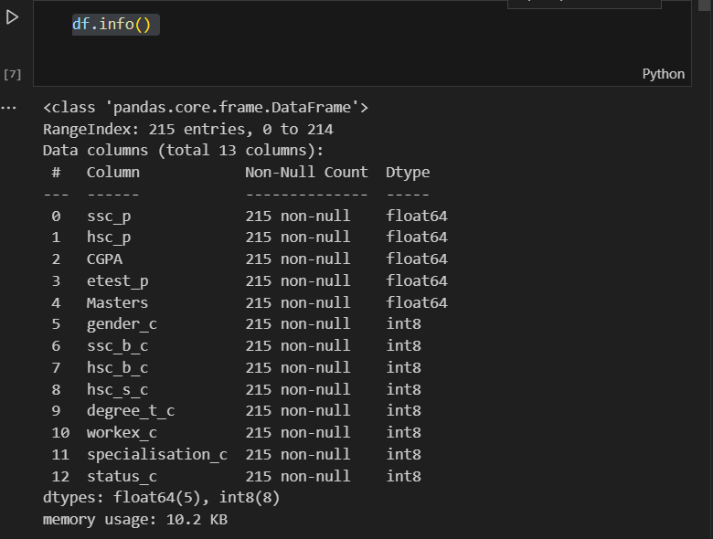
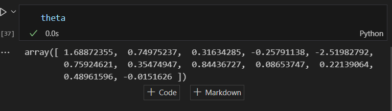
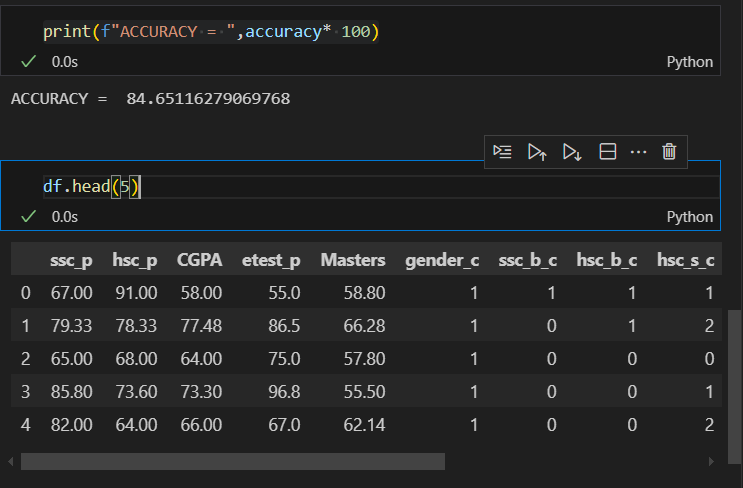

# Implementation-of-Logistic-Regression-Using-Gradient-Descent

## AIM:
To write a program to implement the the Logistic Regression Using Gradient Descent.

## Equipments Required:
1. Hardware – PCs
2. Anaconda – Python 3.7 Installation / Jupyter notebook

## Algorithm
1. IMPORTING NECESSARY LIBERARIES
2. READING PLACEMENT DATA
3. CLEANING DATA
4. IMPORTING GRADIENT DESCENT FUNCTION

## Program:
```
/*
Program to implement the the Logistic Regression Using Gradient Descent.
Developed by: NEMALESHWAR H
RegisterNumber:  212223230142
*/
```
```py
import pandas as pd
import numpy as np
from sklearn.linear_model import LogisticRegression
df = pd.read_csv('Placement_Data_Full_Class (1).csv')
```
## feature Engineering using loops
```py
df.drop('sl_no',axis=1,inplace=True)

for col in df1:
   
    df[f'{col}_c'] = df[col].astype('category').cat.codes

df.drop(columns=df1,inplace=True)
df.info()

```
```py
x = df.iloc[:,:-1].values
x.shape
y= df.iloc[:, -1].values
y.shape
```
GRADIENT DESCENT IMPLEMENTATION
```py
theta = np.random.random(x.shape[1])
Y=y
def sigmoid(z):
    return 1/(1+np.exp(-z))
def loss(theta,x,y):
    h = sigmoid(x.dot(theta))
    return -np.sum(y* np.log(h)+(1-y)*np.log(1-h))
def gradient_descent(theta,x,y,alpha,num_iteration):
    m= len(y)
    for i in range (num_iteration):
        h = sigmoid(x.dot(theta))
        gradient =  x.T.dot(h-y)/m
        theta -= alpha * gradient
    return theta
theta = gradient_descent(theta,x,y,alpha=0.01,num_iteration=1000)
```
## MODEL TRAINING
```py
def predict(theta,x):
    h = sigmoid (x.dot(theta))
    y_pred = np.where(h>=0.15,1,0)
    return y_pred
y_pred = predict(theta,x)

accuracy = np.mean(y_pred.flatten()==y)
accuracy
```
```py
print(f"ACCURACY = ",accuracy* 100)
```
## Output:



## Result:
Thus the program to implement the the Logistic Regression Using Gradient Descent is written and verified using python programming.

